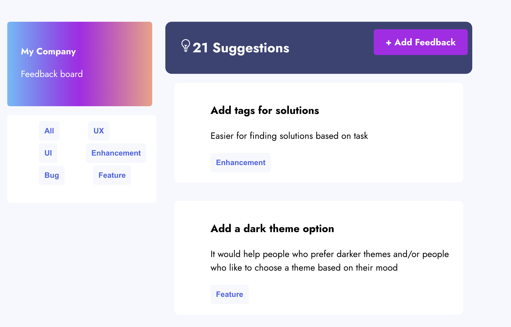
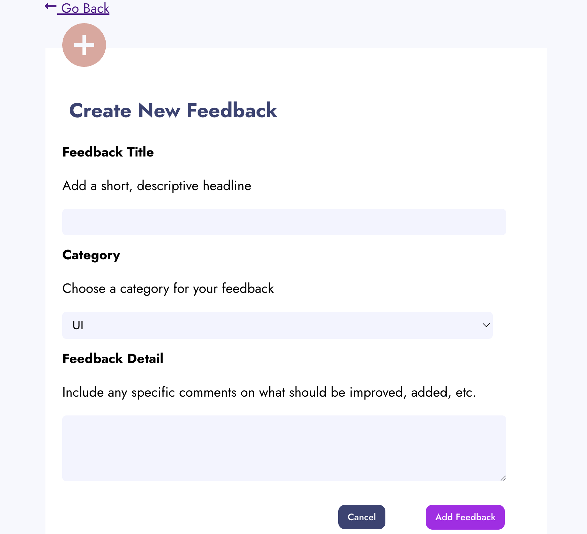

# 📝Product Feedback App

## 📌 Project Description & Purpose

This project is **a place to give feedback about an app by providing suggestions to improve the UX/UI, add enhancement or a new feature.**

## 🚀 Live Site

Check out the app: https://product-feedback-app-by-rucha.netlify.app/

## 🖼️ Screenshots

**Home Page**


**Feedback Form**


## ✨ Features

This is what you can do on the app:

- **You can view all the suggestions.**
- **You can filter suggestions based on category.**
- **You can add a suggestion to the page using the feedback form.**

## 🛠️ Tech Stack

**Frontend**

- **Languages:** **HTML, CSS, JAVASCRIPT **
- **Framework:** **REACT**
- **Deployment:** **NETLIFY**

**Server/API**

- **Languages:** **Node.js**
- **Framework:** **Express.js**
- **Deployment:** **RENDER**

**Database**

- **Languages:** **postgresSQL**
- **Deployment:** **NEON**

## 🔹 API Documentation

These are the API endpoints I built:

1. GET `/get-all-suggestions`
2. GET `/get-suggestions-by-category/:category`
3. POST `/add-one-suggestion`

Learn more about the API endpoints here: [insert link to API documentation]

## 🗄️ Database Schema

Here’s the SQL I used to create my tables:

```sql
CREATE TABLE suggestions
(id SERIAL PRIMARY KEY,
	title VARCHAR,
	description VARCHAR,
	suggestion_type VARCHAR
);
```

## 💭 Reflections

**What I learned:I learned how to build a full stack app using REACT, Express and postgreSQL.**

**What I'm proud of: I am proud of building this app and adding suggestions in the database.**

**What challenged me: The styling part was slightly challenging for me.**

**Future ideas for how I'd continue building this project:**

1. Upvote Suggestions
2. Log in for Users
3. Implement multi-filtering

## 🙌 Credits & Shoutouts

Thanks to **Prof. Arianna** for **her instructions, guidance, and support during this project**!
And thanks to **Bakari** and **Makeba** for **their help and support during this project**!
